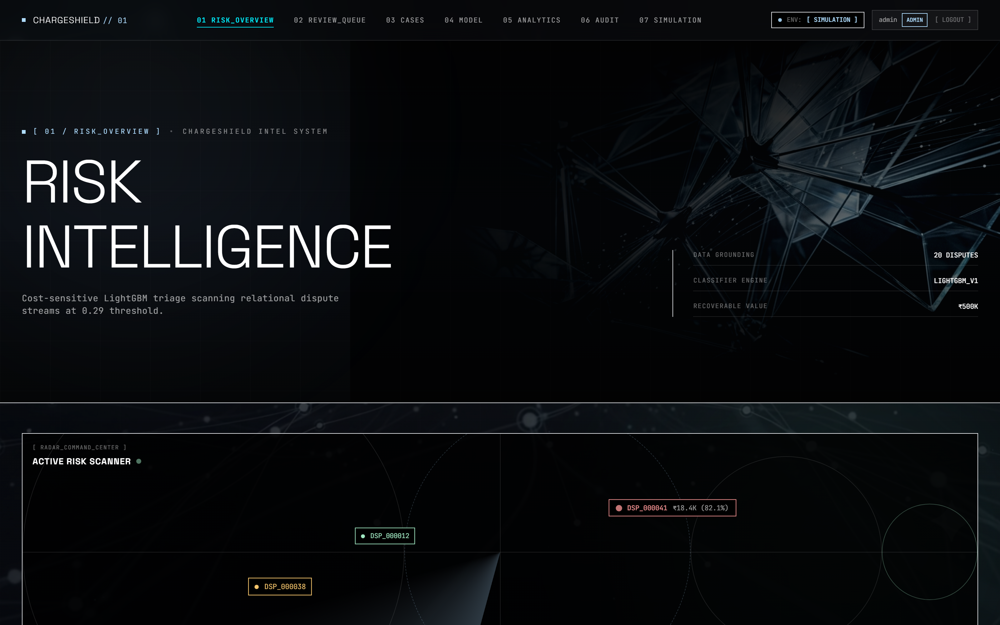
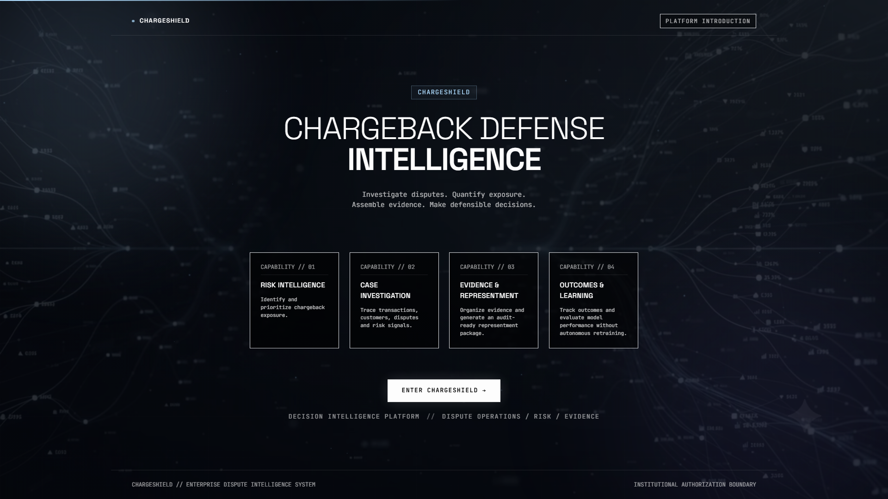
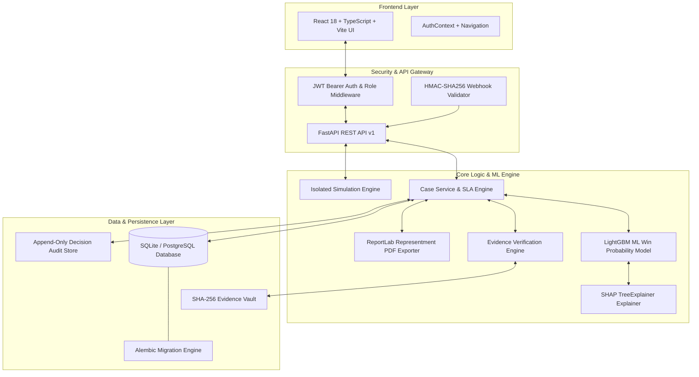
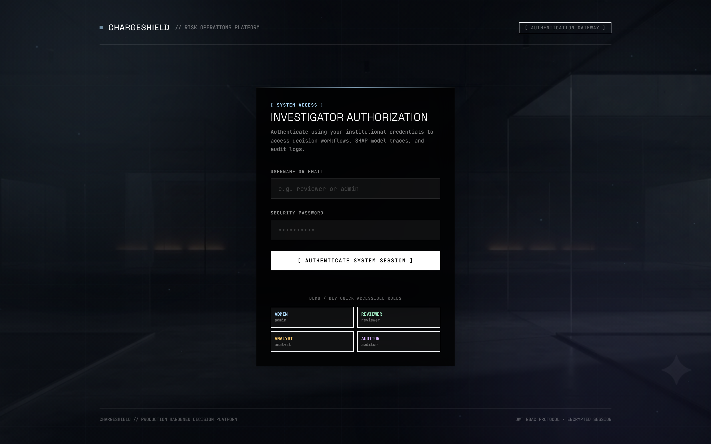
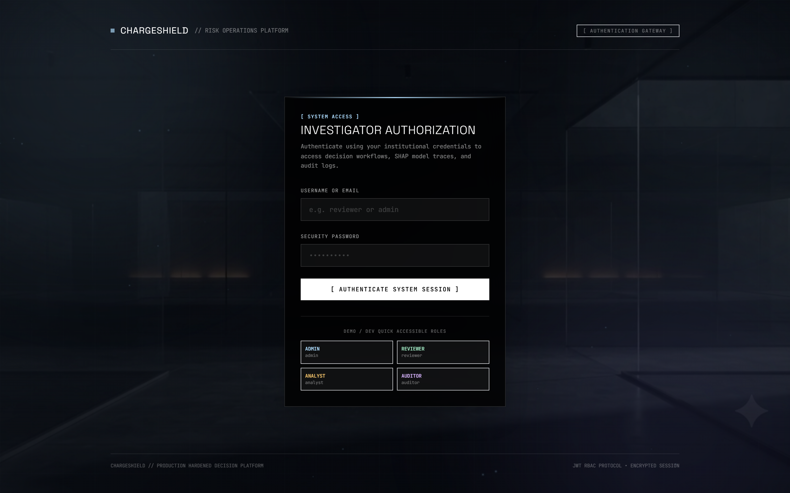
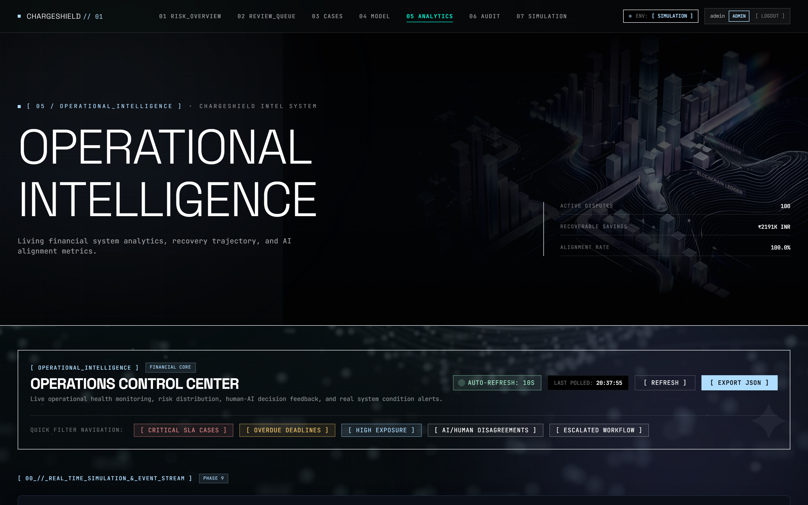

# ChargeShield 🛡️

> **AI-Powered Chargeback Defense & Decision Intelligence Platform**  
> *Enterprise-Oriented Fintech Risk Engineering & Automated Representment Evidence Assembly*

[](https://www.python.org/)
[](https://fastapi.tiangolo.com/)
[](https://react.dev/)
[](https://www.typescriptlang.org/)
[](https://lightgbm.readthedocs.io/)
[](https://pytest.org/)

ChargeShield is an end-to-end chargeback triage, ML-driven risk evaluation, and audit-ready evidence assembly platform designed for digital merchants and payment operations teams. By combining LightGBM win-probability scoring, dual-layer SHAP explainability, deterministic evidence verification, and ReportLab document synthesis, ChargeShield eliminates operational friction in merchant chargeback defense while strictly enforcing human-in-the-loop governance for all consequential financial state transitions.

---

## 1. Visual Preview


*Risk Overview — Live chargeback exposure triage and risk prioritization.*

---

## 2. Platform Introduction



*Platform Introduction — ChargeShield's decision-intelligence workflow across risk, investigation, evidence, and outcomes.*

---

## 3. Safety & Data Governance Disclaimer

> [!IMPORTANT]
> **SYNTHETIC DATASET & HUMAN-IN-THE-LOOP AUTHORIZATION GOVERNANCE:**  
> - **Data Source**: All dispute records, transactions, customer profiles, and carrier tracking logs in ChargeShield are generated synthetically using deterministic seeds. No real customer, merchant, card network, or proprietary payment gateway data is utilized.
> - **Human Authorization Boundary**: ChargeShield **never** executes autonomous financial settlements or external dispute submissions. Machine learning models and automated agents provide advisory probability predictions and structured evidence packages; all financial decisions require explicit authorization by an authenticated human reviewer.
> - **Simulation Isolation**: Live transaction simulation (`[SIMULATION]`) operates in an isolated environment with governor locks to prevent metric pollution in production audit tables.

---

## 4. The Core Problem

When digital merchants receive chargebacks from card networks, payment operations teams face a critical operational dilemma:

> *"Should this merchant spend operational resources contesting this dispute, and if so, can ChargeShield automatically assemble the evidence required for a strong representment case?"*

Contesting every chargeback blindly leads to negative net recovery due to non-refundable filing fees and staff overhead on unwinnable cases. Conversely, conceding valid transactions surrenders recoverable revenue. ChargeShield solves this by combining **cost-sensitive machine learning win-probability scoring** with **automated evidence validation** and **ReportLab PDF generation**.

---

## 5. How ChargeShield Works

ChargeShield processes disputes through a deterministic state machine:

```
[Payment / Webhook Ingestion]
             │
             ▼
[Relational Schema Persistence] ──► (Customer, Order, Transaction, Dispute)
             │
             ▼
[ML Win-Probability Prediction] ──► (LightGBM Model + SHAP Feature Importance)
             │
             ▼
[Cost-Sensitive Risk Engine]   ──► (Net Financial Advantage Calculation)
             │
             ▼
[Evidence Cross-Verification]   ──► (SHA-256 File Validation & Citation Matching)
             │
             ▼
[Human Analyst Triage Queue]   ──► (RBAC Authorization Boundary)
             │
             ▼
[Recorded Human Decision]       ──► (CONTEST / DO_NOT_CONTEST / ESCALATE)
             │
             ▼
[Immutable Audit Ledger]       ──► (Append-Only SQLite / Database Audit Log)
             │
             ▼
[Representment Evidence Package] ──► (Audit-Ready ReportLab PDF Export)
```

---

## 6. System Architecture

ChargeShield is architected as a modular, decoupled full-stack platform:



---

## 7. Core Capabilities

- **Risk Intelligence & Triage**: Computes net contest value by weighing win probability against non-refundable filing fees and operational overhead.
- **Operational Review Queue**: Real-time triage stream ordered by LightGBM priority scores, SLA deadlines, and disputed amounts.
- **Case Investigation Dossier**: Deep case view incorporating customer tenure, transaction velocity, Probability Gauge, and orbital Evidence Network.
- **ML / Model Intelligence**: Comprehensive observability surfacing ROC-AUC curves, confusion matrices, calibration metrics, and SHAP global feature importances.
- **Evidence Management & Repository**: Document repository supporting file uploads (PDF, PNG, JPG, CSV, TXT) with SHA-256 integrity checksum hashing.
- **Audit-Ready Representment PDF Package**: ReportLab document synthesis compiling dispute metadata, carrier tracking, fulfillment proof, and SHA-256 hashes into downloadable evidence packages.
- **Operational Analytics**: Executive financial metrics tracking total exposure, decision agreement rates, and dispute reason code distributions.
- **Isolated Simulation Engine**: Scenario runner for testing fraud spikes (`HIGH_RISK_CHARGEBACK`, `FRIENDLY_FRAUD`) without contaminating production records.
- **Append-Only Decision Audit Log**: Immutable record of reviewer authorizations, decision timestamps, and mandatory justification notes.
- **Granular Authentication & RBAC**: JWT-backed server-side role enforcement across 4 system personas.

---

## 8. Platform Interface Walkthrough

### Case Investigation

*Case Investigation — Case-level financial reasoning, ML assessment, and evidence verification.*

### Model Intelligence

*Model Intelligence — LightGBM governance, calibration, threshold optimization, and outcome feedback.*

### Operational Intelligence

*Operational Intelligence — Operational health, financial recovery analytics, and decision monitoring.*

### Decision Simulation

*Decision Simulation — Isolated scenario testing with production-contamination safeguards.*

---

## 9. Human-in-the-Loop & Role-Based Access Control (RBAC)

ChargeShield enforces strict server-side permission boundaries using FastAPI dependency injection (`require_role`):

| Role | Role Overview | Access Permissions | State Action Boundary |
| :--- | :--- | :--- | :--- |
| **`ADMIN`** | System Administrator | Full access to all platform views, settings, user management, evidence revocation, and bulk operations. | Can submit decisions, manage system settings, and revoke evidence documents. |
| **`REVIEWER`** | Senior Risk Analyst / Manager | Full operational access to Queue, Case Investigation, PDF Export, and Decision Submission. | **Authorized to submit binding human review decisions** (`CONTEST`, `DO_NOT_CONTEST`, `ESCALATE`). |
| **`ANALYST`** | Operations Analyst | Access to Triage Queue, Case Details, Model Intelligence, Analytics, and Simulation. | Read-only analysis and case inspection; cannot submit final financial decisions or revoke files. |
| **`AUDITOR`** | Compliance & Audit Specialist | Restricted read-only access to Audit Logs, Financial Analytics, and System Health. | Inspection-only access to immutable audit records and historical decision trails. |

---

## 10. Machine Learning & Decision Science

### Win-Probability Model (LightGBM)
- **Classifier Architecture**: Gradient boosted decision tree (`LightGBMClassifier`) trained on tabular transaction, customer behavioral, and velocity features.
- **Probability Calibration**: Platt scaling / isotonic calibration ensuring predicted win probabilities correlate accurately with true historical win rates.
- **Cost-Sensitive Decision Threshold Selection**: Rather than using a naive 0.50 cutoff, ChargeShield computes the optimal decision threshold (e.g., `0.29`) by minimizing expected financial loss:
  $$\text{Expected Net Value} = (\text{Disputed Amount} \times P_{\text{win}}) - \text{Filing Fee} - \text{Operational Cost}$$

### Dual-Layer SHAP Explainability
- **Executive Natural Language Summary**: High-level textual explanation translating key risk drivers for non-technical risk managers.
- **Technical SHAP Waterfall Plots**: Quantitative breakdown of base value offset and per-feature impact using SHAP `TreeExplainer`.

### Performance Observability
- Model metrics (ROC-AUC, PR-AUC, F1 Score, Confusion Matrix) are tracked dynamically via `/api/v1/model/performance` to monitor model health and feature drift.

---

## 11. Case Investigation Workflow

1. **Dispute Ingestion**: Webhooks or batch jobs ingest dispute records, populating relational Customer, Order, Transaction, and Dispute models.
2. **Predictive Scoring**: LightGBM model calculates win probability and determines advisory recommendation (`CONTEST` vs `DO_NOT_CONTEST`).
3. **Evidence Cross-Verification**: The verification engine checks dispute claims against order records (e.g., billing address match, carrier tracking delivery status, customer tenure).
4. **Interactive Triage**: Analysts inspect cases via `CaseDetailPage`, evaluating the Probability Gauge, financial net advantage, and evidence completeness score.
5. **Decision Authorization**: Authenticated reviewers submit decisions (`CONTEST`, `DO_NOT_CONTEST`, `ESCALATE`) with mandatory justification notes.
6. **Immutable Logging**: The decision is written to the append-only audit database (`chargeshield.db`).

---

## 12. Evidence Management & Representment Package

### SHA-256 Storage Repository
Physical evidence documents uploaded through the UI undergo:
- MIME-type validation (PDF, PNG, JPG, CSV, TXT)
- File size limit checks (10 MB max)
- Streaming SHA-256 checksum computation
- Storage in the secure file repository with tamper-evident metadata

### Audit-Ready Representment Evidence Package
Using ReportLab, ChargeShield generates downloadable evidence packages (`GET /api/v1/cases/{id}/representment-package`) containing:
- Executive summary cover sheet
- Transaction & dispute claim breakdown
- Carrier tracking & fulfillment verification details
- System-verified evidence citation table
- Cryptographic SHA-256 hashes of attached files

---

## 13. REST API Reference Overview

The FastAPI backend exposes structured endpoints under `/api/v1`:

| Router | Path Prefix | Key Endpoints | Description |
| :--- | :--- | :--- | :--- |
| **Auth** | `/api/v1/auth` | `POST /login`, `GET /me` | JWT authentication and session user profile |
| **Review Queue** | `/api/v1/review-queue` | `GET /` | Filtered, paginated review queue stream |
| **Cases** | `/api/v1/cases` | `GET /{id}`, `POST /{id}/decision`, `GET /{id}/sla` | Case dossier details, decision submission, SLA status |
| **Analytics** | `/api/v1/analytics` | `GET /overview`, `GET /report` | System financial recovery metrics & operational reports |
| **Model** | `/api/v1/model` | `GET /performance`, `GET /registry` | ML model performance metrics, SHAP feature rankings |
| **Simulation** | `/api/v1/simulation` | `GET /status`, `POST /start`, `POST /inject` | Isolated transaction event generator controls |
| **Audit** | `/api/v1/audit` | `GET /decisions` | Append-only human decision audit trail |
| **Evidence** | `/api/v1/cases/{id}/evidence` | `POST /`, `GET /`, `DELETE /{ev_id}` | Evidence document upload, listing, and revocation |
| **Webhooks** | `/api/v1/webhooks` | `POST /dispute` | HMAC-SHA256 authenticated dispute webhook ingestion |

---

## 14. Security & Safeguards

- **JWT Authentication**: Signed JWT tokens with expiration enforcement.
- **Server-Side RBAC**: Route dependency verification (`require_role`) preventing unauthorized state modifications.
- **HMAC-SHA256 Webhook Verification**: Request signature header validation (`X-ChargeShield-Signature`) to verify payment gateway origin.
- **Clock Skew Replay Protection**: Timestamp header verification (`X-ChargeShield-Timestamp`) to reject stale or replayed webhooks.
- **Upload Hardening**: File size restrictions, extension whitelist, and SHA-256 checksum verification.
- **Append-Only Audit Log**: Database table constraints preventing deletion or editing of submitted human decisions.

---

## 15. Isolated Simulation Engine (`[SIMULATION]`)

ChargeShield includes a dedicated simulation engine (`/simulation`) for operational testing:
- **Scenario Profiles**: Inject predefined vectors like `HIGH_RISK_CHARGEBACK`, `FRIENDLY_FRAUD`, or `LOW_AMOUNT_RECURRING`.
- **Production Isolation**: Generated simulation events carry explicit `is_simulation=True` flags and do not pollute production audit tables or training datasets.
- **Governor Locks**: Prevents concurrent simulation runners from exceeding system resource thresholds.

---

## 16. Verification & Testing

ChargeShield includes a comprehensive automated test suite built with Pytest:

```bash
# Run the complete backend test suite (194/194 tests passing)
python -m pytest

# Run the Golden-Path End-to-End Test Suite
python -m pytest tests/test_golden_path_e2e.py -v

# Build the Frontend Production Bundle
cd frontend
npm run build
```

---

## 17. Local Quickstart Guide

### Prerequisites
- Python 3.10+
- Node.js 18+ and npm
- Docker & Docker Compose (Optional, for containerized execution)

---

### Option A — Manual Local Setup

#### 1. Backend Setup
```bash
# Clone the repository
git clone https://github.com/GANESHANCS/ChargeShield.git
cd ChargeShield

# Create and activate virtual environment
python -m venv .venv
# On Windows (PowerShell):
.venv\Scripts\Activate.ps1
# On macOS/Linux:
source .venv/bin/activate

# Install dependencies
pip install -r requirements.txt

# Run database migrations (SQLite chargeshield.db)
python -m alembic upgrade head

# Start FastAPI server
python -m uvicorn backend.main:app --reload --port 8000
```
- API Documentation: `http://127.0.0.1:8000/docs`
- Health Check: `http://127.0.0.1:8000/health`

#### 2. Frontend Setup
```bash
# In a new terminal, navigate to frontend directory
cd frontend

# Install Node dependencies
npm install

# Start Vite development server
npm run dev
```
- Web Application UI: `http://localhost:5173` (or `http://localhost:3000`)

---

### Option B — Docker Containerized Setup

ChargeShield provides a multi-stage Docker build and Docker Compose orchestration:

```bash
# Build and launch PostgreSQL and FastAPI containers
docker-compose up --build
```
- App & API Endpoint: `http://localhost:8000`
- PostgreSQL Container: `chargeshield-postgres` (Port 5432)

---

## 18. Repository Project Structure

```
ChargeShield/
├── backend/                  # FastAPI REST API Backend
│   ├── api/                  # Route handlers & RBAC dependencies
│   │   ├── dependencies.py   # JWT & require_role middleware
│   │   └── v1/               # v1 REST API Routers (cases, auth, model, etc.)
│   ├── core/                 # App configuration & logging
│   ├── db/                   # SQLAlchemy ORM models & database setup
│   ├── schemas/              # Pydantic request/response schemas
│   └── services/             # Core business logic (Case, Review, PDF Export)
├── frontend/                 # React 18 + TypeScript + Vite + Tailwind UI
│   ├── src/
│   │   ├── components/       # Visual UI components, gauges, modal dialogs
│   │   ├── pages/            # Page views (Dashboard, Queue, CaseDetail, Model, etc.)
│   │   ├── services/         # Axios REST API client bindings
│   │   └── types/            # Shared TypeScript interfaces
├── ml/                       # Machine Learning Pipeline
│   ├── train.py              # LightGBM model training & calibration script
│   ├── predict.py            # Win-probability inference engine
│   └── explain.py            # SHAP TreeExplainer explanation service
├── data/                     # Reproducible synthetic dataset generator
├── alembic/                  # Database migration scripts
├── docs/                     # Technical architecture documentation
│   └── screenshots/          # High-resolution platform interface screenshots
├── tests/                    # Pytest test suite (194 passing tests)
├── Dockerfile                # Multi-stage production container build
├── docker-compose.yml        # Docker Compose service orchestration
├── requirements.txt          # Python dependencies manifest
└── README.md                 # Project documentation
```

---

## 19. System Limitations & Transparency

- **Synthetic Relational Dataset**: All data is generated synthetically using reproducible random seeds; ChargeShield is not connected to live card network or merchant financial production streams.
- **Advisory AI Boundaries**: Models and agent systems generate advisory predictions and evidence packages; financial settlement or contestation submission is never automated.
- **Local Database Default**: Out-of-the-box configuration runs on a local SQLite file database (`chargeshield.db`); production deployments can target PostgreSQL via `DATABASE_URL`.
- **Manual Retraining**: Model retraining is triggered via explicit administrative commands rather than automated continuous learning loops.

---

## 20. Engineering Roadmap

- [ ] **Automated Continuous Re-calibration**: Automated drift detection and periodic probability calibration updates upon new ground-truth outcome labeling.
- [ ] **Multi-Tenant Merchant Isolation**: Schema-level multi-tenancy for payment aggregators managing multi-merchant portfolios.
- [ ] **Enhanced OCR Evidence Extraction**: Automated optical character recognition for physical delivery receipts and signed invoice documents.

---

## 21. License

This project is licensed under the MIT License — see the `LICENSE` file for details.
