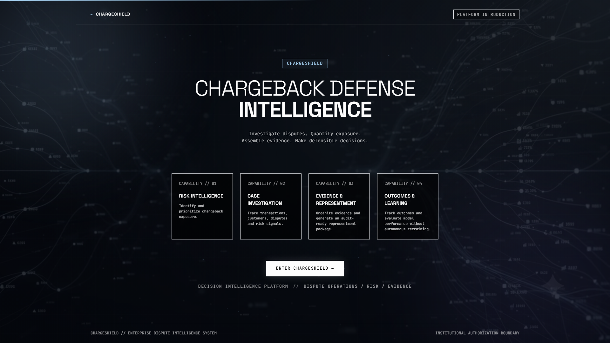
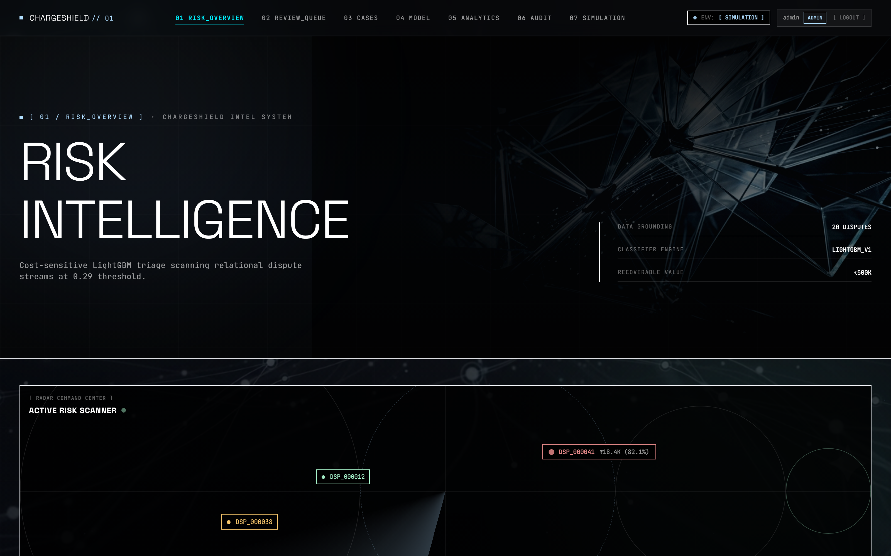
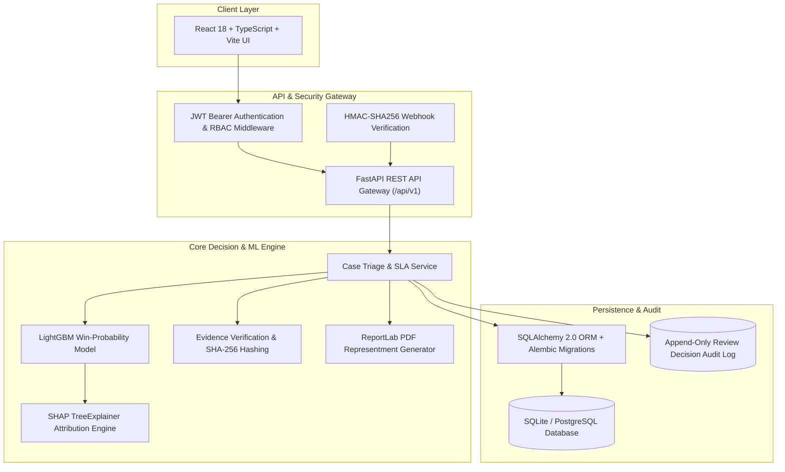
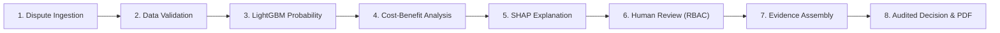
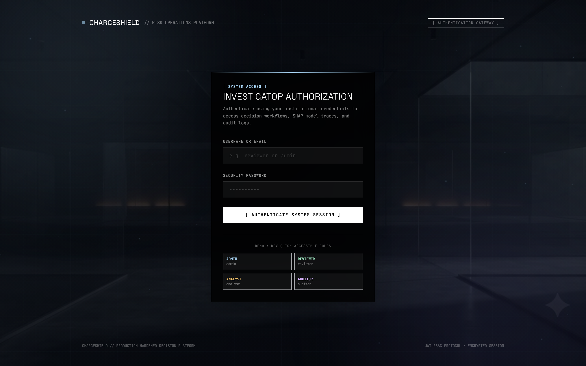
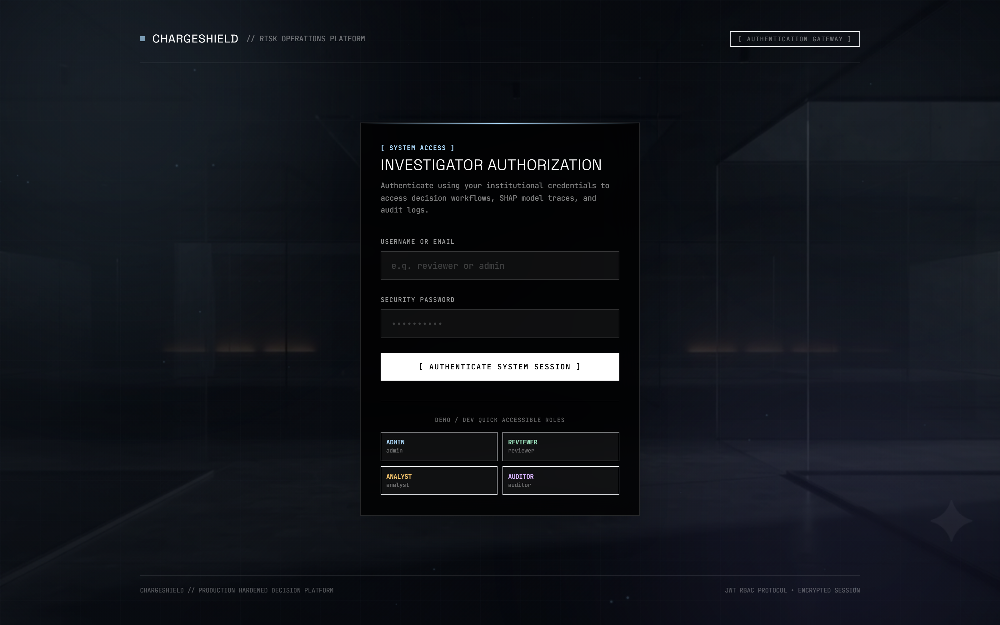
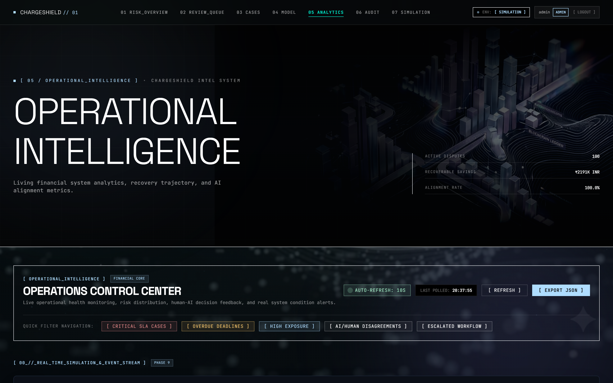

# ChargeShield

> **AI Chargeback Defense & Decision Intelligence Platform**
> *Autonomous risk evaluation, explainable machine learning inference, and audit-ready representment evidence assembly for digital merchants.*

[](https://fastapi.tiangolo.com/)
[](https://react.dev/)
[](https://lightgbm.readthedocs.io/)
[](https://www.docker.com/)
[](tests/)

---

## 1. Visual Platform Overview


*Platform Workflow — Unified decision intelligence across risk triage, case investigation, evidence synthesis, and audit logging.*

<br>


*Risk Overview Dashboard — Live chargeback exposure monitoring, dispute prioritization, and SLA tracking.*

---

## 2. The Problem

Digital merchants face an asymmetric operational challenge when managing payment chargebacks: contesting disputes blindly leads to negative net financial recovery due to non-refundable card network filing fees and extensive analyst investigation hours on unwinnable claims. Conversely, conceding valid transactions surrenders recoverable revenue and increases merchant dispute ratios.

ChargeShield solves this by replacing manual, reactive dispute handling with **cost-sensitive machine learning triage**, automated cryptographic evidence assembly, and strict human-in-the-loop governance.

---

## 3. System Architecture

ChargeShield is designed as a decoupled full-stack platform:


```mermaid
graph TD
    subgraph Client Layer
        UI["React 18 + TypeScript + Vite UI"]
    end

    subgraph API & Security Gateway
        Auth["JWT Bearer Authentication & RBAC Middleware"]
        Router["FastAPI REST API Gateway (/api/v1)"]
        Webhook["HMAC-SHA256 Webhook Verification"]
    end

    subgraph Core Decision & ML Engine
        CaseSvc["Case Triage & SLA Service"]
        Model["LightGBM Win-Probability Model"]
        SHAP["SHAP TreeExplainer Attribution Engine"]
        EvEngine["Evidence Verification & SHA-256 Hashing"]
        PDF["ReportLab PDF Representment Generator"]
    end

    subgraph Persistence & Audit
        ORM["SQLAlchemy 2.0 ORM + Alembic Migrations"]
        DB[("SQLite / PostgreSQL Database")]
        Audit[("Append-Only Review Decision Audit Log")]
    end

    UI --> Auth
    Auth --> Router
    Webhook --> Router
    Router --> CaseSvc
    CaseSvc --> Model
    Model --> SHAP
    CaseSvc --> EvEngine
    CaseSvc --> PDF
    CaseSvc --> ORM
    ORM --> DB
    CaseSvc --> Audit
```

---

## 4. Decision Workflow

Disputes traverse a deterministic state machine enforcing human oversight at every financial boundary:


```mermaid
flowchart LR
    A["1. Dispute Ingestion"] --> B["2. Data Validation"]
    B --> C["3. LightGBM Probability"]
    C --> D["4. Cost-Benefit Analysis"]
    D --> E["5. SHAP Explanation"]
    E --> F["6. Human Review (RBAC)"]
    F --> G["7. Evidence Assembly"]
    G --> H["8. Audited Decision & PDF"]
```

1. **Ingestion & Validation:** Ingests dispute records via HMAC-authenticated webhooks or batch imports into relational entities (`Customer`, `Order`, `Transaction`, `Dispute`).
2. **Inference & Calibration:** Evaluates historical transaction velocity, customer tenure, and behavioral features to predict calibrated dispute win probability ($P_{\text{win}}$).
3. **Cost-Sensitive Analysis:** Evaluates expected net recovery against filing fees to generate an advisory recommendation (`CONTEST` vs `DO_NOT_CONTEST`).
4. **SHAP Attribution:** Computes feature contributions using TreeExplainer, generating executive summaries and quantitative waterfall plots.
5. **Human Review:** Authenticated reviewers inspect cases, verify delivery confirmations, and submit binding decisions.
6. **Evidence Packaging:** Compiles verified citations, tracking proof, and cryptographic SHA-256 hashes into a formal ReportLab PDF representment package.
7. **Immutable Audit:** Records all reviewer actions, timestamps, and justifications in an append-only audit ledger.

---

## 5. ML & Decision Engine

ChargeShield uses machine learning strictly to support, not replace, operational decision-makers:

- **Classification Algorithm:** Gradient-boosted decision trees (`LightGBMClassifier`) trained on tabular transaction attributes, customer velocity, and behavioral signals.
- **Probability Calibration:** Platt scaling and isotonic regression ensure predicted probabilities accurately represent empirical dispute win rates.
- **Cost-Sensitive Optimization:** Instead of a default 0.50 cutoff, the decision engine optimizes the decision threshold to **`0.29`**. Because dispute filing fees are non-refundable, cases with a predicted win probability above 29% yield a positive expected net recovery:
  $$\text{Expected Net Value} = (\text{Disputed Amount} \times P_{\text{win}}) - \text{Filing Fee} - \text{Operational Cost}$$
- **SHAP TreeExplainer:** Provides dual-layer interpretability: natural-language risk summaries for analysts alongside exact SHAP attribution values for audit review.

---

## 6. Human-in-the-Loop Governance

ChargeShield strictly enforces human authorization for all consequential state transitions. Automated algorithms provide advisory scoring only.

Server-side Role-Based Access Control (RBAC) enforces four distinct personas:

| Persona | Operational Scope | State Mutation Authority |
| :--- | :--- | :--- |
| **`ADMIN`** | System configuration, user management, evidence revocation, bulk operations | Full administrative authority |
| **`REVIEWER`** | Case investigation, representment generation, decision submission | **Authorized to submit binding decisions (`CONTEST`, `DO_NOT_CONTEST`, `ESCALATE`)** |
| **`ANALYST`** | Triage queue inspection, model observability, simulation testing | Read-only analysis; cannot commit final financial decisions |
| **`AUDITOR`** | Historical review logs, financial reports, compliance inspection | Read-only inspection of immutable audit records |

---

## 7. Security & Auditability

Security controls are embedded directly into backend routes and database constraints:

| Security Domain | Mechanism | Implementation Details |
| :--- | :--- | :--- |
| **Authentication** | JWT Bearer Tokens | Signed, expiring JSON Web Tokens (`pyjwt`) |
| **Authorization** | Server-Side RBAC | Route dependency injection (`require_role`) across 4 system personas |
| **Webhook Security** | HMAC-SHA256 | Signature validation (`X-ChargeShield-Signature`) with timestamp skew replay protection |
| **Evidence Integrity** | SHA-256 Hashes | Streaming cryptographic digests computed upon upload and tracked in document records |
| **Decision Auditability** | Append-Only Ledger | Relational database constraints preventing modification or deletion of recorded decisions |

---

## 8. Interface Showcase

| **Case Investigation Dossier** | **Model Governance & Observability** |
| :---: | :---: |
| <br><sub>*Deep case telemetry, customer tenure, transaction velocity, and evidence verification.*</sub> | <br><sub>*LightGBM ROC-AUC/PR-AUC curves, calibration error, and SHAP global feature importances.*</sub> |
| **Operational Health & Recovery** | **Isolated Scenario Simulation** |
| <br><sub>*Financial recovery rates, SLA tracking, and dispute reason code distribution.*</sub> | <br><sub>*Isolated fraud spike scenario testing (`[SIMULATION]`) with governor locks.*</sub> |

---

## 9. Verification & Testing

ChargeShield includes a comprehensive automated test suite verifying endpoints, security barriers, model calibration, and document synthesis:

```bash
# Execute the complete backend test suite (194 tests)
python -m pytest

# Run the golden-path end-to-end integration test
python -m pytest tests/test_golden_path_e2e.py -v

# Verify frontend TypeScript types and production build
cd frontend
npm run build
```

**Verification Status:**
- Backend: **194 passed, 0 failed** across 22 test modules (46s execution time).
- Frontend: **Built cleanly in 17.2s** (`tsc && vite build`).

---

## 10. Local Quickstart

### Prerequisites
- Python 3.10+ (tested on Python 3.11 & 3.12)
- Node.js 18+ and npm
- Git

### 1. Backend Setup
```bash
# Clone the repository
git clone https://github.com/GANESHANCS/ChargeShield.git
cd ChargeShield

# Create and activate virtual environment
python -m venv .venv
# Windows (PowerShell):
.venv\Scripts\Activate.ps1
# macOS/Linux:
source .venv/bin/activate

# Install dependencies
pip install -r requirements.txt

# Run database migrations
python -m alembic upgrade head

# Start FastAPI server
python -m uvicorn backend.main:app --reload --port 8000
```
- API Documentation: `http://127.0.0.1:8000/docs`
- Health Check: `http://127.0.0.1:8000/health`

### 2. Frontend Setup
```bash
# In a new terminal, navigate to frontend
cd frontend

# Install dependencies
npm install

# Start Vite development server
npm run dev
```
- Web Application: `http://localhost:5173`

---

## 11. Docker Deployment

ChargeShield includes multi-stage container builds and Docker Compose orchestration with PostgreSQL:

```bash
# Build and start PostgreSQL and FastAPI backend
docker-compose up --build
```
- API & Application Endpoint: `http://localhost:8000`
- PostgreSQL Database: Port 5432 (`chargeshield-postgres`)

---

## 12. API Reference Overview

Interactive OpenAPI documentation is generated automatically by FastAPI:
- **Swagger UI:** `http://127.0.0.1:8000/docs`
- **ReDoc:** `http://127.0.0.1:8000/redoc`

| Router | Prefix | Primary Functions |
| :--- | :--- | :--- |
| **Auth** | `/api/v1/auth` | JWT login, session profiles, role inspection |
| **Review Queue** | `/api/v1/review-queue` | Priority-ranked dispute triage stream |
| **Cases** | `/api/v1/cases` | Case dossiers, SLA tracking, binding decision submission |
| **Model** | `/api/v1/model` | Performance metrics, ROC-AUC curves, SHAP feature rankings |
| **Analytics** | `/api/v1/analytics` | Financial recovery metrics, dispute distribution reports |
| **Evidence** | `/api/v1/cases/{id}/evidence` | Document upload, SHA-256 verification, PDF representment export |
| **Webhooks** | `/api/v1/webhooks` | HMAC-authenticated dispute event ingestion |
| **Simulation** | `/api/v1/simulation` | Scenario injection with production isolation locks |
| **Audit** | `/api/v1/audit` | Append-only human decision logs |

---

## 13. Project Structure

```
ChargeShield/
├── backend/                  # FastAPI backend application
│   ├── api/                  # Route handlers & security dependencies
│   │   └── v1/               # v1 REST API Routers
│   ├── core/                 # Settings, structured logging, middleware
│   ├── db/                   # SQLAlchemy ORM models & session setup
│   ├── evidence/             # Document verification & citation matching
│   └── services/             # Core business logic & PDF generation
├── frontend/                 # React 18 + TypeScript + Vite UI
│   ├── src/
│   │   ├── components/       # UI elements, Probability Gauge, modal dialogs
│   │   ├── pages/            # Dashboard, Queue, CaseDetail, Model pages
│   │   └── services/         # Axios API client bindings
├── ml/                       # Machine Learning Pipeline
│   ├── train.py              # LightGBM training & probability calibration
│   ├── predict.py            # Win-probability inference service
│   ├── explain.py            # SHAP TreeExplainer integration
│   └── artifacts/            # Model joblib binaries & metadata
├── alembic/                  # Database migration scripts (5 versions)
├── docs/                     # Technical specifications & architecture docs
│   └── screenshots/          # Platform interface screenshots
├── tests/                    # Pytest test suite (194 automated tests)
├── .github/workflows/        # CI/CD automation workflows
├── Dockerfile                # Multi-stage production container build
├── docker-compose.yml        # Multi-service container orchestration
└── requirements.txt          # Python dependencies manifest
```

---

## 14. Tech Stack

| Layer | Technologies |
| :--- | :--- |
| **Backend** | Python 3.10+, FastAPI, Pydantic v2, Uvicorn |
| **Frontend** | React 18, TypeScript 5.3, Vite 5.1, Tailwind CSS 3.4, Framer Motion, Recharts |
| **Machine Learning** | LightGBM 4.3+, Scikit-Learn 1.4+, SHAP 0.45+, Pandas, NumPy, Joblib |
| **Database & ORM** | SQLAlchemy 2.0, Alembic 1.13, SQLite (default) / PostgreSQL 15 |
| **Security & Auth** | PyJWT, Passlib (bcrypt), HMAC-SHA256, Server-side RBAC |
| **Document Synthesis** | ReportLab 4.0+ (Dynamic PDF evidence generation) |
| **Testing & Quality** | Pytest 8.1+, Pytest-Asyncio (194 passing test cases) |
| **Infrastructure** | Multi-stage Docker, Docker Compose |

---

## 15. Project Status & Roadmap

- **Status:** Active engineering platform.
- **Data Provenance:** Built and evaluated on reproducible deterministic synthetic datasets. Zero proprietary cardholder or merchant payment information is stored or processed.
- **Future Enhancements:** Continuous probability recalibration loops, multi-tenant merchant isolation, and optical character recognition (OCR) for physical receipts.
- **License:** All rights reserved. Licensing terms to be published.
